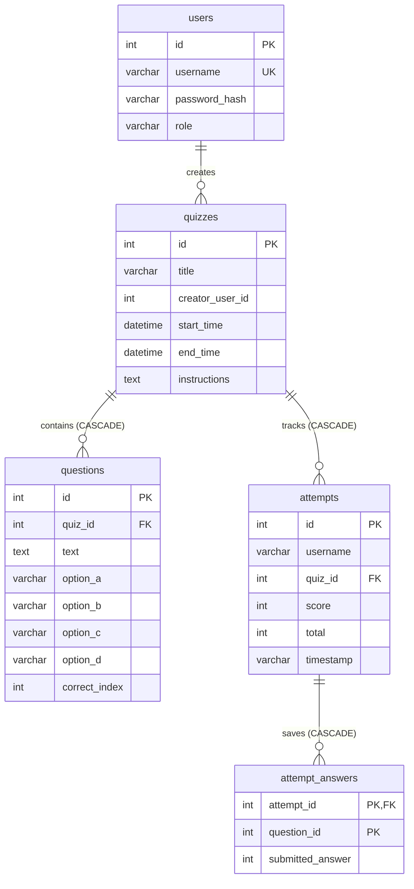

# Vertex Application

Vertex Application is a lightweight, responsive, and robust Java-based web application built with **Spring Boot** and **MySQL**. It features two primary modules:
1. **Quiz Application**: A complete assessment system for creating, managing, attempting, and reviewing time-locked quizzes.
2. **QR Code Generator**: A utility service that dynamically creates customizeable QR codes from any web URL.

Instead of heavy ORMs (like Hibernate/JPA), the application implements raw **JDBC** for direct and efficient communication with the MySQL database, ensuring full control over SQL queries, transactions, and performance.

---

## 🚀 Key Features

### 1. User Authentication & Authorization
* **Role-Based Access**: Dedicated workflows and dashboards for **Admins** (Instructors/Creators) and **Students**.
* **Secure Storage**: Passwords are secure and stored using **SHA-256** hashing.
* **Session Management**: Secure state tracking across page refreshes and redirects using HTTP sessions.

### 2. Quiz Management (Admins)
* **Quiz Creation**: Define quiz titles, total questions, instructions, and time bounds (start time and end time).
* **Question Management**: Add, edit, or delete questions inside quizzes. 
* **Input Validation**: Automatically rejects duplicate question texts and duplicate multiple-choice options within a quiz.
* **Editing Locks**: Quizzes automatically lock from administrative changes **5 minutes before the start time** to ensure test integrity.

### 3. Quiz Taking & Grading (Students)
* **Time-Bound Attempts**: Quizzes are accessible only during the active window (after the start time and before the end time).
* **Single Attempt Constraint**: Students are restricted to exactly one submission per quiz.
* **Instant Grading**: Automatically calculates scores in real-time and persists the results.
* **Leaderboards**: Displays a scoreboard for each quiz, sorted by score in descending order.
* **Integrity-Preserving Review**: Students can view a question-by-question review of their correct/incorrect choices **only after the quiz has officially ended**.

### 4. Dynamic QR Code Generator
* **Utility Service**: Generates high-quality PNG QR code image streams dynamically from any input URL.
* **Custom Sizing**: Allows custom dimensions for the output QR code.
* **ZXing Integration**: Leverages the Google ZXing library for encoding.

---

## 🛠️ Technology Stack

* **Backend Framework**: Spring Boot 3.3.1 (Java 17)
* **Database & Persistence**: MySQL, Spring Boot Starter JDBC
* **Templating Engine**: Thymeleaf (HTML5 / CSS3 layout integrations)
* **QR Generation Library**: Google ZXing (core & javase 3.5.2)
* **Build System**: Maven

---

## 🗄️ Database Schema

The database consists of five related tables managed via direct SQL constraints and cascade deletes:



### Table Definitions (`schema.sql`):
1. **`users`**: Stores user profiles, credentials, and roles (`ADMIN` or `STUDENT`).
2. **`quizzes`**: Stores basic info about each quiz, including validity windows and instructions.
3. **`questions`**: Stores multiple-choice questions linked to a specific quiz.
4. **`attempts`**: Records overall scores, total questions, and timestamps for student attempts.
5. **`attempt_answers`**: Stores the index of the submitted answer for every question in a specific attempt.

---

## ⚙️ Configuration & Setup

### Prerequisites
* **Java SDK 17** or higher
* **Apache Maven** 3.8+
* **MySQL Server** 8.0+

### Step 1: Database Setup
1. Log into your MySQL console:
   ```bash
   mysql -u root -p
   ```
2. Run the SQL schema script provided in the root directory:
   ```sql
   SOURCE schema.sql;
   ```
   *(This creates the database `quizapp` and compiles the necessary tables.)*

### Step 2: Configure Properties
Modify the database credentials in `src/main/resources/application.properties` to match your MySQL environment:
```properties
spring.datasource.url=jdbc:mysql://localhost:3306/quizapp?useSSL=false&serverTimezone=UTC&allowPublicKeyRetrieval=true
spring.datasource.username=YOUR_MYSQL_USERNAME
spring.datasource.password=YOUR_MYSQL_PASSWORD
```

### Step 3: Build and Run
Run the Spring Boot application using Maven:
```bash
mvn clean install
mvn spring-boot:run
```
The application will launch on port `8080` by default. Visit `http://localhost:8080/` in your browser.

---

## 🔌 API Endpoints Reference

### Authentication Page Routes:
* `GET /` — Root landing page (select between Quiz App and QR Generator).
* `GET /login` — Login screen.
* `POST /login` — Authenticates user and initiates session.
* `GET /register` — Registration screen.
* `POST /register` — Creates user account with hashed password.
* `GET /logout` — Ends active session.

### Admin Dashboard / Management Routes:
* `GET /admin-dashboard` — Main portal for administrators.
* `GET /admin-check-my-quizzes` — Lists quizzes created by current admin.
* `GET /create-quiz` — Start quiz configuration.
* `POST /create-quiz` — Validates meta inputs and starts adding questions.
* `GET /add-question` / `POST /add-question` — Step-by-step wizard for adding questions.
* `GET /manage-my-quizzes-login` — Security checkpoint password check.
* `GET /manage-my-quizzes` — Master quiz management view.
* `GET /manage-one-quiz` — View questions, locked status, add, edit, or delete options for a quiz.
* `GET /add-question-existing` / `POST /add-question-existing` — Adds a question to a configured quiz.
* `GET /edit-question` / `POST /edit-question` — Edits an existing question.
* `GET /delete-question` — Deletes a question and re-indexes remaining questions automatically.

### Student Dashboard / Quiz Routes:
* `GET /student-dashboard` — Main portal for students.
* `GET /available-quizzes` — Browse all quizzes.
* `GET /attempt-quiz` — List quizzes with status (active / expired).
* `GET /attempt-quiz/{quizId}` — Pre-quiz screen showing time status, instructions, or past score details.
* `GET /start-quiz/{quizId}` — Initializes the student attempt in the session.
* `GET /attempt-question` — Renders active question in-progress.
* `POST /attempt-submit` — Grades answer choice, updates session data, and redirects to next question.
* `GET /attempt-finish` — Finalizes score, writes attempt answers to DB, and clears session data.
* `GET /my-attempted-quizzes` — History of completed quizzes with links to review them.
* `GET /review-quiz/{attemptId}` — Question-by-question review (active only *after* the quiz end time).
* `GET /leaderboard?quizId={id}` — Score standings for a specific quiz.

### QR Code Routes:
* `GET /qr-generator` — Renders QR input generator page.
* `POST /generate` — Takes URL and size via URL-encoded form data; returns raw image byte stream inline.
